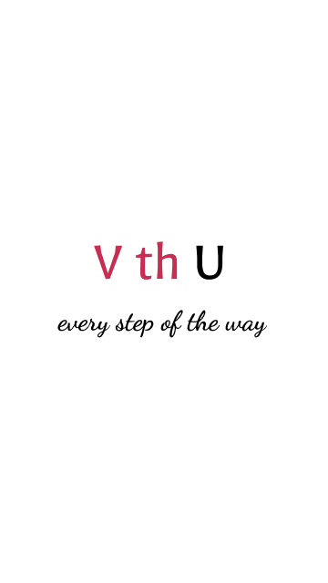
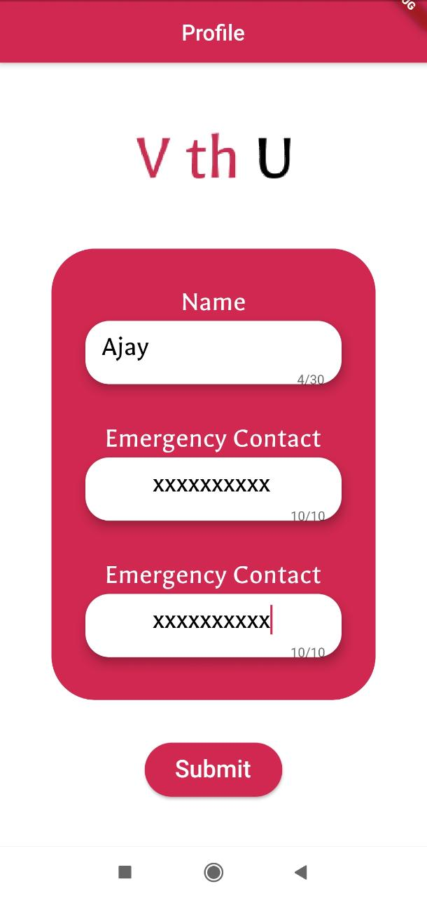
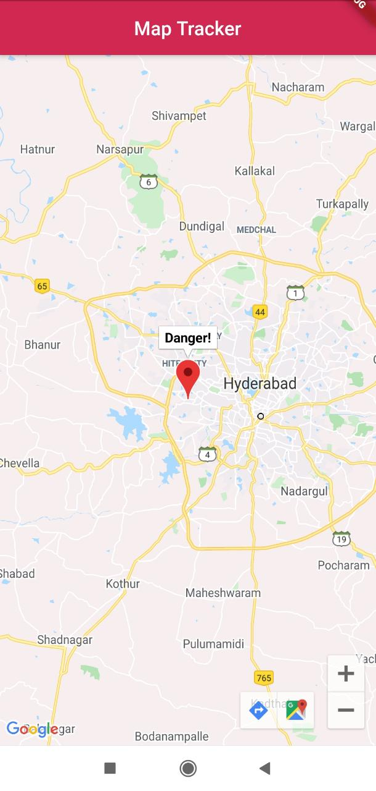
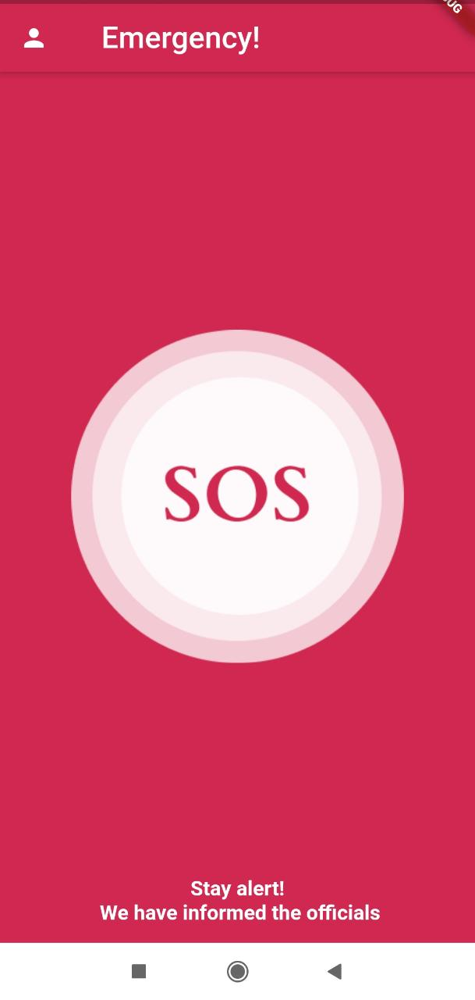
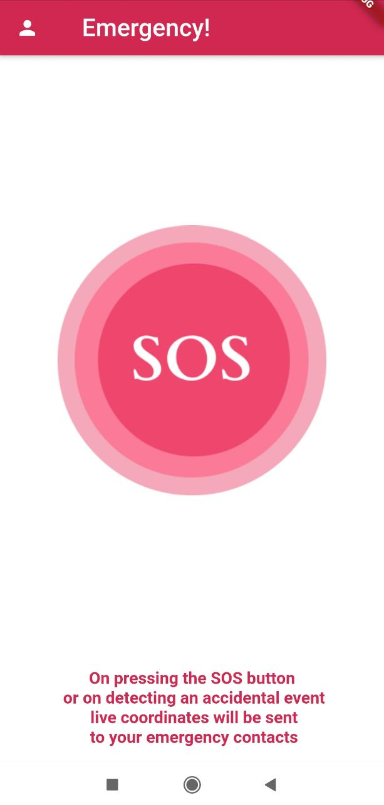
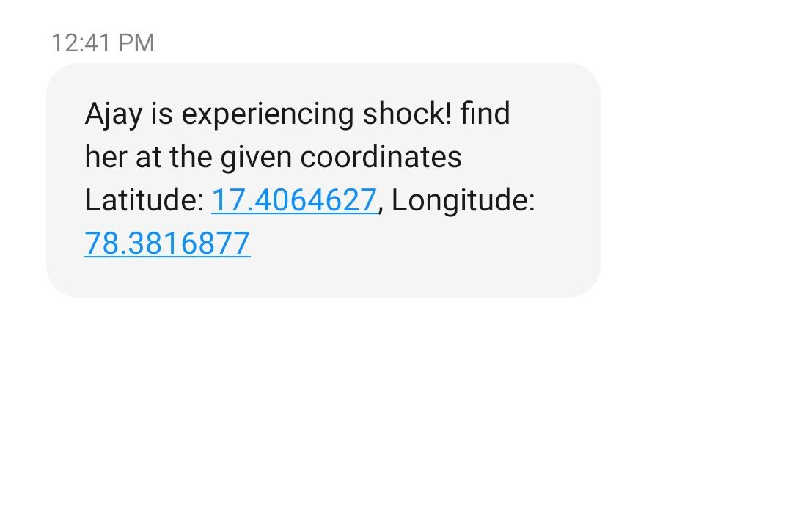

# VthU

A platform that keeps you safe on the go and can automatically send a distress call if you are in danger 
Devfolio Link: https://devfolio.co/submissions/vthuevery-step-of-the-way

## The problem it solves
* VthU is a platform where a person's safety is monitored and is detected via fitness bands when they are in danger
* When the app identifies if a person is in danger, it send their to emergency contacts and also to the nearest police station
* This app reads the vitals from the IOT device i.e. fiteness band every minute and if it sees an unusual spike in heart rate combined with an unusual/remote location, it raises an alarm
* To prevent flase positives, a 15 second timer is initiated the moment it detects danger and the user can abort it if its a false alarm
* It also is smart enough to distinguish if the high heartrate is due to exercise or an actual danger

## Challenges we ran into

## User Interface

